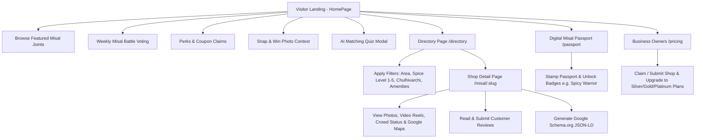

# 🌶️ Nashik's Best Misal — Project Documentation

**Nashik Top Misal** is a full-stack local food directory, discovery platform, and gamified review web application tailored for Nashik's legendary *Misal Pav* culinary culture. Built for both local food lovers and weekend tourists, it features real-time crowd meters, interactive maps, digital stamp passports, AI recommendation engines, photo contests, weekly fan battles, and B2B partner sponsorship tiers.

---

## 🛠️ 1. Tech Stack

### **Frontend Stack**
- **Framework & Core**: [React 18](file:///e:/nashik_top_misal/frontend/package.json) with [Vite](file:///e:/nashik_top_misal/frontend/package.json) (Fast HMR & ES Modules build system).
- **Routing**: [React Router v6](file:///e:/nashik_top_misal/frontend/package.json) (`BrowserRouter`, `Routes`, `Route`).
- **State & Data Fetching**: 
  - [@tanstack/react-query v5](file:///e:/nashik_top_misal/frontend/package.json) for backend query caching & asynchronous state management.
  - React Context API ([`FilterContext`](file:///e:/nashik_top_misal/frontend/src/context/FilterContext.jsx), [`AuthContext`](file:///e:/nashik_top_misal/frontend/src/context/AuthContext.jsx), [`LanguageContext`](file:///e:/nashik_top_misal/frontend/src/context/LanguageContext.jsx)).
- **HTTP Client**: [Axios](file:///e:/nashik_top_misal/frontend/src/services/api.js).
- **Interactive UI & Mapping**:
  - `leaflet` & `react-leaflet` for interactive map widgets.
  - `framer-motion` for page micro-animations & modal transitions.
  - `lucide-react` for modern icon set.
  - `canvas-confetti` & `lottie-react` for gamification animations.
- **SEO & Metadata**: `react-helmet-async` for dynamic HTML document `<head>` updates and Schema.org JSON-LD generation.

### **Backend Stack**
- **Framework**: [FastAPI](file:///e:/nashik_top_misal/backend/app/main.py) (Python 3.10+) asynchronous REST API.
- **Server**: `uvicorn[standard]` (ASGI Server).
- **Database & ORM**: 
  - [SQLAlchemy 2.0](file:///e:/nashik_top_misal/backend/requirements.txt) ORM.
  - Default DB: SQLite ([`nashik_misal.db`](file:///e:/nashik_top_misal/backend/nashik_misal.db)).
  - Supported Drivers: `pymysql` & `psycopg2-binary` for MySQL/PostgreSQL deployment.
- **Data Validation & Schemas**: [Pydantic v2](file:///e:/nashik_top_misal/backend/app/schemas/shop.py) & `pydantic-settings`.
- **Database Migration**: `alembic`.

### **Styling & CSS System**
- **Utility CSS**: [Tailwind CSS v3](file:///e:/nashik_top_misal/frontend/tailwind.config.js) with PostCSS and Autoprefixer.
- **Custom Utility Extensions**: Defined in [`index.css`](file:///e:/nashik_top_misal/frontend/src/index.css) using `@layer utilities`.

---

## 🌊 2. Application Flow & User Journeys



### Key User Flows:
1. **Homepage Discovery**: Users are introduced to featured spots, live fan battles, perk coupons, photo contests, and an AI-powered 1-minute quiz matching their spice tolerance.
2. **Directory & Multi-Filter Search**: Users filter misal spots by Nashik area (Gangapur Road, Panchavati, Peth Road, College Road, etc.), spice rating (1 to 5 - *Zanzanit*), traditional wood stove (*Chulhivarchi*), and amenities (Parking, Garden, Sweets).
3. **Shop Detail & Review Interaction**: Detailed page featuring real-time crowd meters (Low, Moderate, Crowded, Full), video reels player, direct Google Maps directions, and user review submission with image attachment.
4. **Digital Misal Passport (Gamification)**: Gamified loyalty flow where users collect virtual stamps for visiting spots, unlocking badges like *"Spicy Warrior"* 🌶️ and *"Nashik Misal Legend"* 🏆 with celebratory confetti.
5. **Restaurant Owner Monetization**: Shop owners can list their spot or subscribe to **Silver (₹9,999/yr)**, **Gold (₹24,999/yr)**, or **Platinum (₹49,999/yr)** sponsorship plans with direct PhonePe / UPI integration to developer **Tejas Thakare**.

---

## 🔌 3. API Endpoints Overview

All REST API endpoints are grouped under prefix `/api/v1` in [`api.py`](file:///e:/nashik_top_misal/backend/app/api/v1/api.py):

| Category | Endpoint | Method | Description |
| :--- | :--- | :--- | :--- |
| **Shops** | `/api/v1/shops/` | `GET` | Filter, search & list misal shops (paginated) |
| | `/api/v1/shops/` | `POST` | Submit & register a new misal shop |
| | `/api/v1/shops/areas` | `GET` | Get distinct active Nashik areas |
| | `/api/v1/shops/{slug}` | `GET` | Fetch detailed shop profile by URL slug |
| | `/api/v1/shops/{slug}/schema` | `GET` | Get Google Schema.org `Restaurant` JSON-LD payload |
| **Reviews** | `/api/v1/reviews/` | `POST` | Submit a customer review & spice rating |
| | `/api/v1/reviews/shop/{shop_id}` | `GET` | Fetch approved reviews for a specific shop |
| **Battle** | `/api/v1/battle/current` | `GET` | Fetch active weekly head-to-head battle match-up |
| | `/api/v1/battle/vote` | `POST` | Cast a vote for Shop A or Shop B |
| **Coupons** | `/api/v1/coupons/` | `GET` | Retrieve active food discount vouchers & perks |
| | `/api/v1/coupons/claim` | `POST` | Generate unique coupon voucher code & QR payload |
| **Contest** | `/api/v1/contest/leaderboard` | `GET` | Get photo contest leaderboard & upvote rankings |
| | `/api/v1/contest/upvote` | `POST` | Upvote a food photo contest entry |
| **Passport** | `/api/v1/passport/{user_id}` | `GET` | Retrieve user digital passport stamps & badges |
| | `/api/v1/passport/{user_id}/stamp/{shop_id}` | `POST` | Add a new digital stamp to user passport |
| **Quiz** | `/api/v1/quiz/recommend` | `POST` | Get personalized shop recommendations from quiz answers |
| **Sponsorship** | `/api/v1/sponsorship/plans` | `GET` | Get business sponsorship tiers & payment details |
| | `/api/v1/sponsorship/subscribe` | `POST` | Subscribe shop to Silver/Gold/Platinum tier |
| **Ads & Meta** | `/api/v1/ads/slot/{slot_name}` | `GET` | Fetch active advertisement banner slot |
| | `/api/v1/activities/` | `GET` | List available shop amenity & feature tags |

---

## 🎨 4. CSS Architecture & Design System

The application uses **Tailwind CSS v3** supplemented with custom design tokens in [`tailwind.config.js`](file:///e:/nashik_top_misal/frontend/tailwind.config.js) and custom utility classes in [`index.css`](file:///e:/nashik_top_misal/frontend/src/index.css).

### Color Palette
- **Brand Palette (Flame Orange)**:
  - Base: `#fff7ed` (`brand-50`)
  - Primary Accent: `#f97316` (`brand-500` - Flame Orange)
  - Deep Spicy Red-Orange: `#ea580c` (`brand-600`)
- **Spice Level Indicators (`spice`)**:
  - `1 - Mild`: Emerald Green (`bg-emerald-100 text-emerald-800`)
  - `2 - Medium`: Lime Green (`bg-lime-100 text-lime-800`)
  - `3 - Hot`: Amber (`bg-amber-100 text-amber-800`)
  - `4 - Extra Hot`: Orange (`bg-orange-100 text-orange-800`)
  - `5 - Zanzanit 🔥`: Pulsing Red (`bg-red-100 text-red-800 animate-pulse`)

### Custom CSS Classes in [`index.css`](file:///e:/nashik_top_misal/frontend/src/index.css)
- **`.glass-card`**: Glassmorphism effect (`bg-white/90 backdrop-blur-md border border-amber-100 shadow-sm hover:shadow-md`).
- **`.sponsored-border`**: Gold gradient outline for paid partner spots (`border-2 border-amber-400 shadow-lg shadow-amber-200/50`).
- **`.badge-sponsored`**: Gold/Orange badge pill (`bg-gradient-to-r from-amber-500 via-orange-500 to-amber-600 text-white`).
- **Custom Scrollbar**: Warm amber background (`#fef3c7`) with vibrant orange thumb (`#f97316`).

---

## 🌟 5. Important Features & Highlights

1. **Bilingual Support (English / Marathi Toggle)**:
   - Dynamic language switching handled via [`LanguageContext.jsx`](file:///e:/nashik_top_misal/frontend/src/context/LanguageContext.jsx).
   - Defaults to Marathi (`mr`) for local authentic feel with headlines like *"अनुभवा नाशिकची खरी झणझणीत मिसळ"*.

2. **Real-time Crowd Status Meter**:
   - Shops showcase live crowd levels: `Low / Quick seating`, `Moderate (5-10 min wait)`, `Crowded (15-30 min wait)`, or `Peak Rush / Full`.

3. **Short Video Clips (Reels Player)**:
   - Built-in modal video player in shop details (`VideoReelsPlayer.jsx`) allowing users to preview steaming *tarri* pouring clips before visiting.

4. **Floating AI Assistant Chatbot**:
   - Accessible from any page via [`MisalAIChatbot.jsx`](file:///e:/nashik_top_misal/frontend/src/components/ai/MisalAIChatbot.jsx), providing instant recommendation responses.

5. **Creator & Payment Contact**:
   - Integrated developer attribution to **Tejas Thakare** (Lead Developer & Website Maker) with direct PhonePe / UPI integration (`7058638277@ybl`).

---

## 🚀 6. Quick Start & Execution

### Backend Setup:
```bash
cd backend
python -m venv venv
# Activate venv: venv\Scripts\activate (Windows) or source venv/bin/activate (Linux/Mac)
pip install -r requirements.txt
python seed.py              # Seeds database with famous Nashik spots
uvicorn app.main:app --reload --port 8000
```

### Frontend Setup:
```bash
cd frontend
npm install
npm run dev                 # Starts Vite dev server at http://localhost:5173
```
